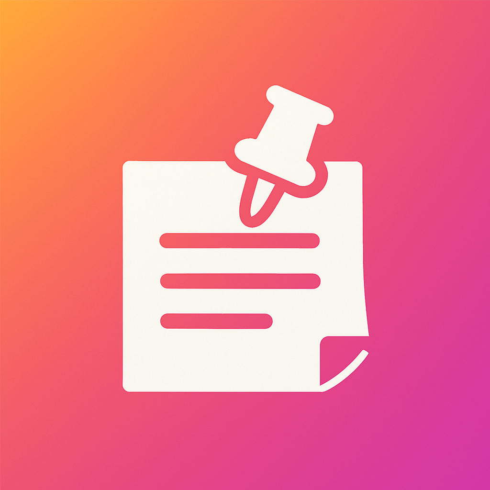
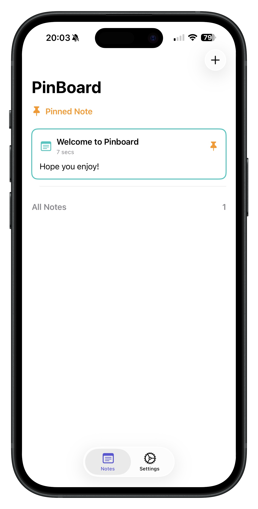
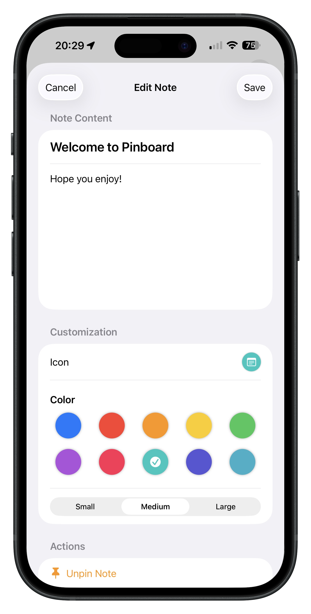
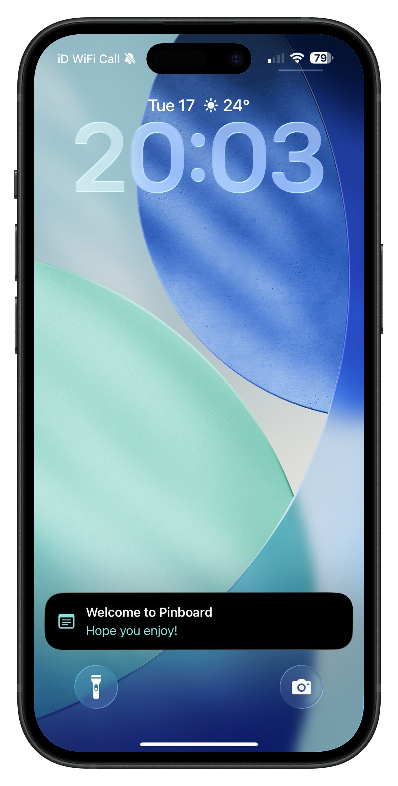

# PinBoard

<div align="center">
  
  
  *A beautiful, feature-rich note-taking app for iOS with widget support and live activities*
  
  
  
  
  
  
  <br>
  
  <a href="https://testflight.apple.com/join/NmpwygSt">
    
  </a>
</div>

##  Features

###  Note Management
- **Create & Edit Notes**: Rich text notes with customizable formatting
- **Icon Selection**: Choose from a variety of SF Symbols for your notes
- **Color Themes**: Multiple accent colors including blue, green, purple, pink, and more
- **Font Sizing**: Adjustable font sizes for better readability
- **Pin to Widget**: Pin your most important notes to iOS widgets for quick access

### Customization
- **Themeable Interface**: Light and dark mode support with system integration
- **Custom App Icons**: Multiple app icon variants (blue, bubblegum, dark, green, purple, pink, dark red)
- **Accent Colors**: Personalize the app with your preferred color scheme
- **Adaptive Design**: Beautiful UI that adapts to different screen sizes

###  iOS Integration
- **Home Screen Widgets**: View pinned notes directly from your home screen
- **Live Activities**: Real-time note updates with Dynamic Island support (iOS 16.1+)
- **App Intents**: Quick actions for creating notes and opening the app
- **CoreData Integration**: Reliable local data persistence

### 🛠 Technical Features
- **SwiftUI Architecture**: Modern, declarative UI framework
- **Core Data**: Robust data management and persistence
- **Widget Extensions**: Native iOS widget support
- **Activity Kit**: Live Activities and Dynamic Island integration
- **App Storage**: User preferences and settings persistence

## 📸 Screenshots

<div align="center">
  
  
  
</div>

<div align="center">
  <em>PinBoard's beautiful interface showcasing note management, creation flow, and customization options</em>
</div>

## Getting Started

### Prerequisites
- **Xcode 16.0+**
- **iOS 18.0+** target deployment
- **macOS Sonoma** for development

### Installation

1. **Clone the repository**
   ```bash
   git clone https://github.com/JoshOn360Hz/PinBoard-App.git
   cd PinBoard-App
   ```

2. **Open in Xcode**
   ```bash
   open PinBoard.xcodeproj
   ```

3. **Build and Run**
   - Select your target device or simulator
   - Press `Cmd + R` to build and run

### Project Structure

```
PinBoard/
├── Core/                    # Core functionality and helpers
│   ├── AppHelpers.swift     # Note operations and utilities
│   ├── AppTheme.swift       # Theme and color management
│   ├── IconData.swift       # Icon definitions and data
│   ├── LiveActivityManager.swift # Live Activities management
│   └── Persistence.swift   # Core Data stack
├── Models/                  # Data models
│   ├── AppIcon.swift        # App icon model
│   ├── Note+Extensions.swift # Note entity extensions
│   └── SharedModels.swift   # Shared data structures
├── Views/                   # SwiftUI views
│   ├── ContentView.swift    # Main app container
│   ├── NoteListView.swift   # Notes list interface
│   ├── CreateNoteView.swift # Note creation
│   ├── EditNoteView.swift   # Note editing
│   ├── SettingsView.swift   # App settings
│   └── SharedComponents/    # Reusable UI components
└── PinBoardWidgets/         # Widget extension
    ├── PinBoardWidgets.swift # Widget implementation
    └── PinBoardWidgetsLiveActivity.swift # Live Activities
```

##  Usage

### Creating Notes
1. Tap the "+" button to create a new note
2. Add a title and content
3. Choose an icon and color theme
4. Save your note

### Pinning to Widget
1. Long press on any note in the list
2. Select "Pin to Widget" from the context menu
3. Your note will appear in the home screen widget

### Customizing Appearance
1. Go to **Settings** tab
2. Choose your preferred **accent color**
3. Select **app icon** variant
4. Toggle **dark/light mode** preference

## Architecture

PinBoard follows modern iOS development patterns:

- **MVVM Architecture**: Clean separation of concerns
- **SwiftUI**: Declarative UI with state management
- **Core Data**: Local data persistence
- **Widget Extensions**: Native widget support with App Intents
- **Live Activities**: Real-time updates using ActivityKit


### Development Guidelines
1. Follow Swift style guidelines
2. Write clean, documented code
3. Test on multiple iOS versions
4. Ensure widgets work correctly
5. Maintain accessibility standards


## Acknowledgments

- Built using SwiftUI
- Icons powered by SF Symbols
- Widget framework by Apple
- Core Data for reliable persistence

##  Requirements

- **iOS 18.0+**
- **Xcode 15.0+**
- **Swift 5.7+**

---

<div align="center">
  <p>Made with ❤️ by Josh</p>
</div>
